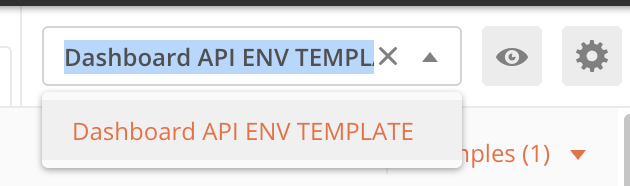
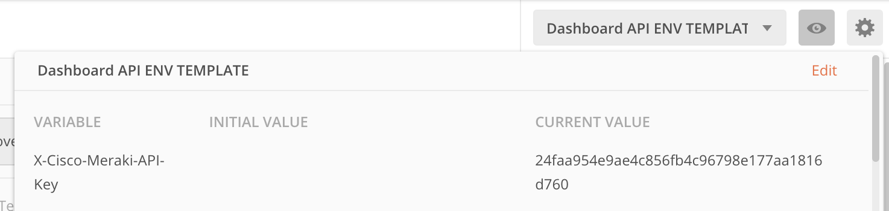
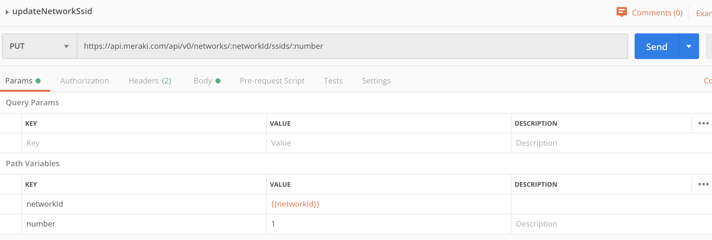

# REST APIs for Network Automation Lab

Written by Greg Shuttleworth. Any questions please reach out to gshuttle@cisco.com.

# Introduction

This guide introduces the concepts of REST APIs, and then demonstrates how to get started using APIs against Cisco Meraki Dashboard using the Postman graphical API client, followed by an introduction to using Python to programmatically utilize APIs.

# What is a REST API

An API (Application Programming Interface) enables two pieces of software to communicate with each other.

Instead of humans interfacing with software, software interfaces with software. Rather than having a human point and click through a workflow, an API exposes functionality to another application.

REST is an API framework built on HTTP, and the interface points are often for web services. When you combine REST and API, you see a simple service interface that enables applications or people to use the HTTP protocol to request objects or information.

# Meraki API

[Meraki](https://meraki.cisco.com/) is a cloud based networking solution from Cisco. You are going to use the Meraki cloud API to programmatically make changes to a Meraki sandbox network.

Meraki employs an 'API first' development strategy where any new features must have an associated API to allow easy control, modification and automation.

The Meraki API follows the [Open API specification](https://www.openapis.org/) and has extensive documentation here: https://developer.cisco.com/meraki/api/#/rest

# Prerequisites

1. Install the Postman graphical API call software. https://www.getpostman.com/
2. Download the code in this Git Repository.
3. Install Python https://www.python.org/downloads/
4. Activate a Meraki Small Business Sandbox from Cisco DevNet. https://devnetsandbox.cisco.com/ 
5. Activate and save an API Token for your Meraki Sandbox (Detailed instructions [here](https://developer.cisco.com/meraki/api/#/rest/getting-started/enabling-the-dashboard-api))

# Using Postman for API calls

Postman is a application that provides an easy way to interact with and learn REST APIs using a graphical interface. We are going to use Postman to explore the Meraki Dashboard REST API and gather a few bits of information that we will use later when we use Python to interact programmatically with the Meraki API.

## Get the Meraki Postman Collection

Meraki provides a Postman collection that contains pre-defined methods for integrating with the Meraki API.

1. Go to http://postman.meraki.com and click 'Run in Postman'.
2. On the 'open with...' Dialogue select your installed version of Postman.
3. The Meraki Postman Collection should now import.

If you have any issues importing and using the Postman collection you can find more information [here](https://developer.cisco.com/meraki/build/meraki-postman-collection-getting-started/).

## Store Meraki API Token in Postman

We need to tell Postman the Meraki Dashboard API key that we created in the prerequisites section above.

To do this we need to edit the Postman environment variables.

1. Select the 'API Dashboard ENV Template' environment using the dropdown at the top right of Postman. 
2. Click on the eye/view icon at the top right of Postman.
3. Insert your API token in the 'Current Value' section for 'X-Cisco-Meraki-API-Key'. 

## Get Organization ID

For most Meraki API calls the or organization ID must be passed as a parameter. This is required so that Meraki can identify which Organization you are working with. The Organization ID can be found by using the API.

1. Select the `getOrganizations` API call, found in (`Organizations/getOrganizations`).
2. Click 'Send' to activate the API call.
3. The API call should have returned a response with a status: `200 ok`. If this has not worked you have probably incorrectly saved your API Key in postman.
4. The API response contains details about all the organizations your Meraki account has access to.

   The response should look similar to this:

   ```json
   [
     {
       "id": "549236",
       "name": "DevNet Sandbox",
       "url": "https://n149.meraki.com/o/-t35Mb/manage/organization/overview"
     }
   ]
   ```

   Save the ID returned for the Organization 'DevNet Sandbox' in the Postman environment variable 'organizationId' (the same way you did for your API key).

5. You should also take a note of the ID as we will need it later for the Python section.

## Get Network ID

Now we have the organization ID, we need to get the Network ID. Again this can be done through the API in a similar way to how we got the organization ID.

1. Select the `getOrganizationNetworks` API call, found in (`Networks/getOrganizationNetworks`).
2. Deselect the 'configTemplateId' query parameter.
3. Click 'Send' to activate the API call. _Note: This time Postman is sending the organization ID as a parameter in the API call._
4. The API call should have returned a response with a status: `200 ok`. If this has not worked you have probably incorrectly saved your API Key in postman.
5. The API response contains details about all the networks your Meraki organization contains.

   The response should look similar to this:

   ```json
   [
     {
       "id": "L_646829496481104046",
       "organizationId": "549236",
       "name": "DNSMB1-gshuttle@cisco.com",
       "timeZone": "America/Los_Angeles",
       "tags": null,
       "productTypes": ["appliance", "phone", "switch", "wireless"],
       "type": "combined",
       "disableMyMerakiCom": false,
       "disableRemoteStatusPage": true
     },
     {
       "id": "L_646829496481104033",
       "organizationId": "549236",
       "name": "steve",
       "timeZone": "America/Los_Angeles",
       "tags": " tag1 tag2 ",
       "productTypes": ["appliance", "camera", "switch"],
       "type": "combined",
       "disableMyMerakiCom": false,
       "disableRemoteStatusPage": true
     },
     {
       "id": "L_646829496481104034",
       "organizationId": "549236",
       "name": "Long Island Office",
       "timeZone": "America/Los_Angeles",
       "tags": " tag1 tag2 ",
       "productTypes": ["appliance", "camera", "switch"],
       "type": "combined",
       "disableMyMerakiCom": false,
       "disableRemoteStatusPage": true
     }
   ]
   ```

6. There will be a number of different networks in the result. Find the id associated with your network (your email address should be in the name).

7. Save the ID returned for your network in the Postman environment variable 'networkId' (the same way you did for your API key).

8. You should also take a note of the network ID as we will need it later for the Python section.

## Create an SSID with Postman _(Optional)_

Now we have gathered the API key, organization ID and Network ID we can successfully use the rest of the API calls.

To demonstrate how easy making changes with the API is, we will create a new wireless SSID, turn it on, then turn it off again (we will do this again but using Python later!)

### Create and enable a new SSID

1. In the Meraki Dashboard, open the SSIDs page and take a look at what SSIDs are currently setup. (`Wireless --> SSIDs`)
2. Open the `updateNetworkSdid` API call found in (`SSIDs/updateNetworkSdid`).
3. Set the 'number' path variable to 1. (This is the number for the SSID in Meraki.)
   
4. Go to the 'Body' settings for the API call and configure the settings for the SSID you want to create.

   The settings should look similar to this:

   ```json
   {
     "name": "My New SSID Name",
     "enabled": true
   }
   ```

5. Click Send
6. Check the Meraki Dashboard SSID page to confirm the new SSID has been created and is now active.

### Disable the new SSID

To disable the new SSID using the API, do exactly the same as the previous step, but change the body of the API call so that enabled is false.

e.g.

```json
{
  "name": "My New SSID Name",
  "enabled": false
}
```

After running this API call, check the Meraki Dashboard to confirm that the SSID is now disabled.

# Using Python for API calls

Now we have used Postman to make API calls, we can use a programming language such as Python to truly unleash the power of APIs.

In this section we will look at a simple python script to interface with the Meraki API and then run it to see how it works.

## Create a Python Virtual Environment

When working with Python, it is strongly recommended that it is done so from a virtual environment. A Virtual Environment acts as isolated working copy of Python which allows you to work on a specific project without worry of affecting other projects.

To get started with your own virtual environment, just run the following in a terminal:

Create the virtual environment:

```bash
$ python3 -m venv .
```

Activate the virtual environment:

```bash
$ source bin/activate .
```

You have now successfully created a Python virtual environment and activated it.

If you need to leave the virtual environment, use this command:

```bash
$ deactivate
```

## Install Python modules

We will use the requests module to make API calls with Python.
To install this, run these commands from within your virtual environment.

```bash
$ pip install requests
```

## Create and enable an SSID

Open the code file `ssid_toggle.py` in a text editor. If you do not have a text editor installed, I recommend downloading Atom to get started (http://atom.io).

This Python script makes the same API call we used in Postman earlier to create a wireless SSID.

```python
""" Enable/Disable Wifi on a Meraki Network """

import requests

# ****** START EDIT THIS ******

api_key = "24faa954e9ae4c856fb4c96798e177aa1816d760"  # Replace with your API key
network_id = "L_646829496481104046"  # Replace with your Network ID
ssid_number = "1"  # Replace with your ssid number to edit

# ****** STOP EDIT THIS  ******

url = "https://api.meraki.com/api/v0/networks/{}/ssids/{}".format(
    network_id, ssid_number
)

headers = {"X-Cisco-Meraki-API-Key": api_key}
payload = {
    "name": "Wifi Name Here",
    "enabled": "true",
}

response = requests.request("PUT", url, data=payload, headers=headers)

print("\nAPI Response: \n{}".format(response.text))
print("\nStatus code: {}".format(response.status_code))
```

Before you can run it you must make a few changes so that the code uses your own API key and network ID.

You only need to edit the code between the two comments: `****** START EDIT THIS ******` and `****** STOP EDIT THIS ******`.

Once you have done this, run the code from inside your virtual environment using:

```bash
$ python ssid_toggle.py
```

You can check the SSID has been created in the Meraki Dashboard.

To change the API call to disable the SSID or change the name of the SSID, edit the `name` and `enabled` variables.

```python
payload = {
    "name": "Wifi Name Here",
    "enabled": "false",
}
```
